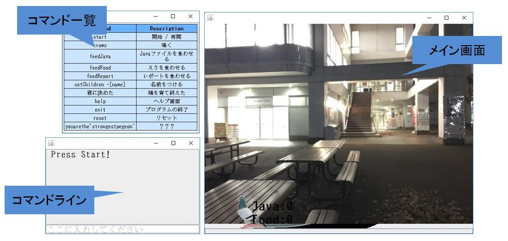
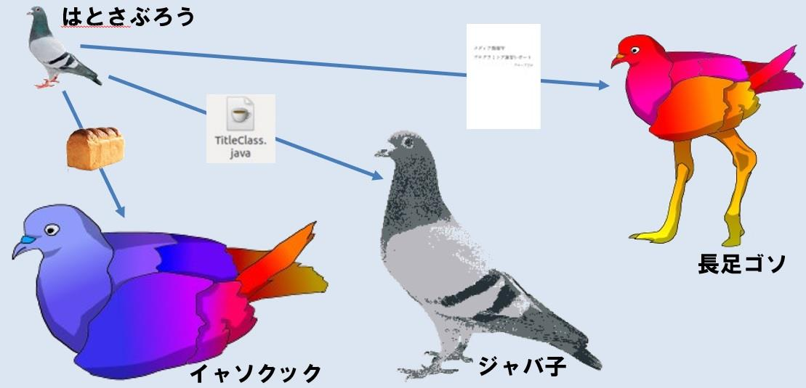

# pegeon-quest
鳩のようで鳩ではない何かを育成するゲーム

このゲームは、鳩っぽいなにかにパン、Javaファイル、レポートの3種類の餌を与えて、進化させるゲームである。
ゲームの操作は、キーボードからの入力によって行い、各種コマンドではとっぽい何かに餌を与えたり、鳴かせることができる。
なお、途中で育成を放棄すると、Game Overとなる。

# ゲーム画面

# 進化の概要

